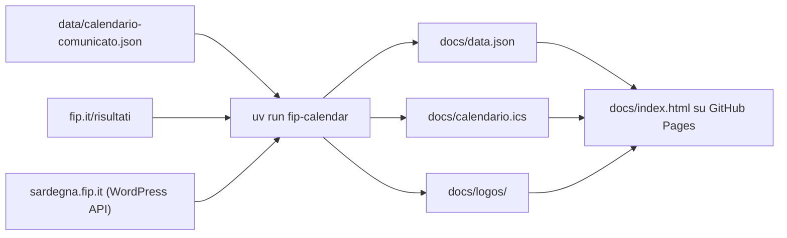

[English](./README.md) | **Italiano**

# Basket Assemini Black, calendario Divisione Regionale 2 2026/27

Pagina web con le 22 partite del Basket Assemini Black nella Divisione Regionale 2 sarda (Girone Sud A), aggiornata in automatico dal sito della Federazione Italiana Pallacanestro (FIP).


La pagina è pubblicata su **https://andreabonn.github.io/campionato-promozione-26-27/** e si può installare sul telefono come app.

Un job di GitHub Actions legge le pagine dei risultati di fip.it ogni 4 ore, e ogni ora dalle 17 a mezzanotte, perché la DR2 gioca anche nei giorni feriali. A ogni lettura aggiorna:

- giorno, ora e campo di ogni gara, segnalando cosa è cambiato rispetto al calendario ufficiale (Comunicato Ufficiale n. 11 del 05/10/2026);
- gli arbitri, appena la FIP li pubblica;
- risultati e classifica ufficiale, più tutte le gare del girone giornata per giornata, ciascuna giornata con il link al referto stampabile della FIP;
- i provvedimenti del Giudice Sportivo sulle gare omologate;
- il calendario in abbonamento `calendario.ics`, per Google Calendar o l'app Calendario di iOS;
- le comunicazioni della FIP Sardegna sulla DR2 e sull'Assemini;
- gli stemmi delle società, quando le società li caricano su fip.it.

La pagina mostra anche la prossima partita con il conto alla rovescia, le soste, i link a Google Maps e Google Calendar, l'andamento recente della squadra, il risultato dell'andata nelle gare di ritorno e l'orario dell'ultimo controllo riuscito su fip.it.

## In pratica

Ogni gara in `docs/data.json` porta i dati correnti di fip.it accanto a quelli del calendario ufficiale. Questa è la gara n. 874, anticipata dalla FIP di un giorno e spostata di mezz'ora:

```json
{
  "round": "A8",
  "n": 874,
  "home": "Basket Sulcispes",
  "away": "Basket Assemini Black",
  "date": "2026-11-28",
  "time": "19:00",
  "official": { "date": "2026-11-29", "time": "18:30" },
  "changes": ["date", "time"],
  "status": "non-designata"
}
```

La pagina legge `changes` e mostra sotto la gara "Spostata dalla FIP", con data, ora e campo del comunicato.

Il comunicato dà a due gare (n. 834 e n. 944) la data del 30 giugno 2027, che la FIP usa quando la data non è ancora fissata. La pagina le mostra in fondo, sotto "Data da definire", e il calendario in abbonamento non le contiene finché la FIP non pubblica la data vera.

## Stack tecnologico

- **Sincronizzazione**: Python 3.12+, `beautifulsoup4`, `pillow` per gli stemmi, `urllib` della libreria standard
- **Pagina**: HTML e moduli JavaScript ES, senza framework né build, web app manifest, service worker
- **Pubblicazione**: GitHub Actions e GitHub Pages
- **Sviluppo**: uv, pytest con pytest-cov, ruff, mypy in modalità strict, `node --test`

## Architettura



Lo scraper gira solo dentro GitHub Actions; la pagina è statica ed è il browser a scaricare `data.json`.

- Le gare si abbinano per numero di gara FIP (`n`), mai per nome della squadra: su fip.it i nomi includono gli sponsor.
- `docs/data.json` e `docs/calendario.ics` vengono riscritti e committati solo quando il contenuto cambia, quindi la cronologia git registra ogni variazione decisa dalla FIP.
- La classifica viene dalla FIP, che conta solo i risultati omologati; la pagina prende vittorie e sconfitte dai risultati delle giornate e le posizioni dalla classifica.
- Gli stemmi vengono copiati nel repository (solo immagini servite da `backend.fip.it`), ritagliati dalle scansioni della FIP e ridotti a 128 px, così la pagina non carica mai immagini da fip.it. Al 09/10/2026 nessuna società del girone ne ha caricato uno.
- `docs/status.json` (ultimo controllo riuscito) non è versionato: arriva al sito solo con l'artefatto di Pages. Se una sincronizzazione fallisce, il deploy salta e la pagina continua a mostrare l'ultimo controllo andato a buon fine.
- Se l'API della FIP Sardegna non risponde, restano le comunicazioni già note e la sincronizzazione non fallisce.

## Prerequisiti

- [uv](https://docs.astral.sh/uv/)
- Python 3.12 o successivo (uv lo installa se manca)
- Node.js, solo per i test JavaScript

## Installazione

```bash
git clone https://github.com/AndreaBonn/campionato-promozione-26-27.git
cd campionato-promozione-26-27
uv sync
```

## Esecuzione locale

```bash
uv run fip-calendar                                   # legge fip.it e aggiorna docs/data.json e docs/calendario.ics
uv run python -m http.server 8765 --directory docs    # apri http://127.0.0.1:8765
```

`fip-calendar` fa 22 richieste a fip.it, a un secondo di distanza l'una dall'altra, più 3 ricerche sulle comunicazioni della FIP Sardegna e 2 letture della categoria "Campionati regionali" e dei comunicati.

La pagina va aperta via HTTP: da file locale il browser blocca la lettura di `data.json`.

Non c'è configurazione tramite variabili d'ambiente: girone, URL e tempi di attesa sono costanti in `src/fip_calendar/config.py`.

### Comandi da riga di comando

| Comando | Cosa fa |
|---|---|
| `uv run fip-calendar` | Sincronizzazione completa: fip.it, comunicazioni FIP Sardegna, stemmi, tabellini |
| `uv run fip-calendar-stamp-sw` | Scrive la versione dell'app in `docs/sw.js` (solo nel deploy) |
| `uv run fip-calendar-check-aliases` | Confronta i nomi delle squadre di playbasket.it con la classifica corrente |

### Web app

La pagina si installa grazie a `docs/manifest.webmanifest` e al service worker `docs/sw.js`. Il service worker lavora in modalità network first: la cache risponde solo quando la rete non c'è, così online i dati FIP non sono mai vecchi.

Quando esce una nuova versione della pagina compare un avviso con due scelte: "Aggiorna" ricarica tutte le schede aperte, "Più tardi" lo nasconde fino alla prossima apertura. La versione è un hash dei file di `docs/` esclusi i dati FIP, calcolato da `uv run fip-calendar-stamp-sw` durante il deploy. La copia nel repository deve mantenere `const VERSION = "dev";`: se lanci il comando in locale, ripristina il file.

Le icone si generano dallo stemma `docs/logo-assemini.png`, ritagliato da `assets/assemini-logo.jpeg`:

```bash
uv run --script scripts/make_icons.py
```

## Struttura del repository

```text
.
├── assets/               # stemma originale dell'Assemini
├── data/                 # calendario ufficiale, Comunicato Ufficiale n. 11 del 05/10/2026 (JSON trascritto e PDF originale)
├── docs/                 # sito pubblicato: pagina, moduli JS, dati generati, calendario .ics, manifest, service worker, icone
├── scripts/              # generazione delle icone (script PEP 723 con ambiente proprio)
├── src/fip_calendar/     # lettura di fip.it, confronto con il comunicato, .ics, comunicazioni, stemmi, tabellini
├── tests/                # test pytest, pagine salvate in fixtures/, test JS in js/
└── .github/workflows/    # sincronizzazione programmata, controllo dei nomi e deploy su Pages
```

`docs/data.json`, `docs/boxscores.json` e `docs/calendario.ics` sono generati: non vanno modificati a mano.

## Testing

```bash
uv run pytest        # test Python (con --cov per la copertura di righe e rami)
uv run ruff check .  # lint
uv run mypy          # type check strict su src/ e tests/
npm test             # regole e viste JS della pagina (node --test, nessuna dipendenza)
```

I test girano senza rete sulle pagine salvate in `tests/fixtures/` e non leggono mai `docs/data.json`, così una correzione della FIP non può bloccare la sincronizzazione. Quando fip.it cambia struttura, salva lì la nuova pagina e riproduci il problema in un test prima di correggere lo scraper.

## Deploy e CI/CD

Un solo workflow, `.github/workflows/sync-fip.yml`, parte a ogni push su `main`, su richiesta manuale e secondo questo calendario:

| Quando | Cron (UTC) |
|---|---|
| Ogni 4 ore | `17 */4 * * *` |
| Ogni giorno, ogni ora dalle 17 a mezzanotte ora italiana | `47 15-23 * * *` |

Ha tre job:

- **sync**: esegue i test Python e JavaScript, lancia `fip-calendar`, committa `data.json`, `boxscores.json`, `calendario.ics` e gli stemmi se sono cambiati, marca la versione del service worker e carica `docs/` come artefatto di Pages;
- **deploy**: pubblica l'artefatto su GitHub Pages;
- **alias-check**: lancia `fip-calendar-check-aliases` dopo la sincronizzazione. Fallisce da solo quando una squadra cambia nome su fip.it (per esempio un nuovo sponsor) e non blocca il deploy.

Se fip.it non risponde o la struttura delle pagine è cambiata, la sincronizzazione si ferma senza toccare `data.json` e GitHub invia un'email di notifica. Il log indica cosa non è stato trovato.

## Limiti

- fip.it non ha un'API pubblica documentata: lo scraper legge l'HTML delle pagine dei risultati e va aggiornato quando la FIP cambia il layout.
- La formula mostrata nella pagina (prime 4 ai playoff, nessun playout) è quella della DR2 Sud 2025/26, quando il girone Sud era uno solo. Quella del 2026/27 non è ancora pubblicata.
- La FIP non pubblica i tabellini di questo campionato. I punti dei giocatori arriverebbero da playbasket.it (inseriti dagli utenti, riusati senza scopo commerciale e con attribuzione), ma quella sincronizzazione non è ancora attiva: la tabella dei nomi delle squadre (`PLAYBASKET_TEAM_ALIASES` in `src/fip_calendar/config.py`) si compila dopo il primo tabellino dell'Assemini Black. Finché è vuota, la sincronizzazione non legge playbasket.it.
- GitHub sospende i workflow programmati dopo 60 giorni senza attività sul repository.

## Sicurezza

La pagina non ha login, form né segreti: mostra dati pubblici della FIP. Per segnalare una vulnerabilità, consulta [SECURITY.it.md](./SECURITY.it.md).

## Licenza

Il codice è rilasciato con licenza MIT, vedi [LICENSE](./LICENSE). Lo stemma dell'A.S.D. Basket Assemini (`docs/logo-assemini.png`, `assets/assemini-logo.jpeg`), gli stemmi delle società copiati da fip.it e il calendario ufficiale FIP (`data/11-DR2-calendario-definitivo-Sud-A.pdf`) restano dei rispettivi titolari e non sono coperti dalla licenza.

## Supporta il progetto

Se questo progetto ti è stato utile, lascia una stella su [GitHub](https://github.com/AndreaBonn/campionato-promozione-26-27): aiuta altri a scoprirlo.

Il calendario del Basket Assemini Black è gratuito. Se vuoi contribuire, puoi lasciare un'offerta tramite PayPal. L'importo lo scegli tu ed è del tutto facoltativo.

<p align="center">
  <a href="https://paypal.me/AndreaBonacci19"></a>
</p>
