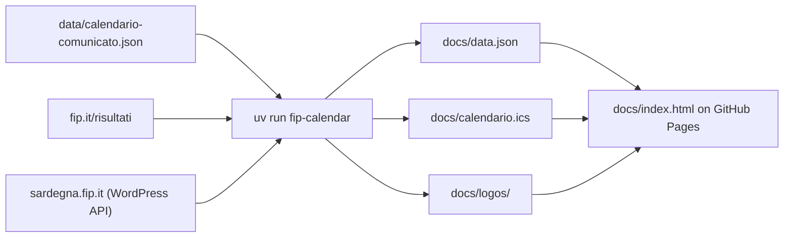

**English** | [Italiano](./README.it.md)

# Basket Assemini Black, Divisione Regionale 2 2026/27 calendar

A web page with the 22 games of Basket Assemini Black in the Sardinian Divisione Regionale 2 (Girone Sud A), kept up to date automatically from the Italian Basketball Federation (FIP) website.


The page is published at **https://andreabonn.github.io/campionato-promozione-26-27/** and can be installed on a phone as an app. Its text is in Italian.

A GitHub Actions job reads the fip.it results pages every 4 hours, and every hour from 17:00 to midnight Italian time, because DR2 games are also played on weekday evenings. Each run updates:

- date, time and venue of every game, flagging what changed compared with the official calendar (Comunicato Ufficiale n. 11 of 05/10/2026);
- referees, as soon as FIP publishes them;
- results and the official standings, plus every game of the group round by round, each round linked to FIP's printable report;
- disciplinary decisions (Giudice Sportivo) on homologated games;
- the subscribable calendar `calendario.ics`, for Google Calendar or the iOS Calendar app;
- FIP Sardegna notices about DR2 and about Assemini;
- club crests, when clubs upload them to fip.it.

The page also shows the next game with a countdown, breaks in the schedule, Google Maps and Google Calendar links, the team's recent form, the first-leg result on return games and the time of the last successful check on fip.it.

## In practice

Every game in `docs/data.json` carries the current fip.it data next to the official calendar's. This is game 874, moved by FIP one day earlier and half an hour later:

```json
{
  "round": "A8",
  "n": 874,
  "home": "Basket Sulcispes",
  "away": "Basket Assemini Black",
  "date": "2026-11-28",
  "time": "19:00",
  "official": { "date": "2026-11-29", "time": "18:30" },
  "changes": ["date", "time"],
  "status": "non-designata"
}
```

The page reads `changes` and shows "Spostata dalla FIP" (moved by FIP) under the game, with the official date, time and venue.

The official calendar gives two games (834 and 944) the date 30 June 2027, which FIP uses when a date is not set yet. The page lists them last under "Data da definire" (date to be set), and the subscribable calendar leaves them out until FIP publishes the real date.

## Tech stack

- **Sync**: Python 3.12+, `beautifulsoup4`, `pillow` for the crests, `urllib` from the standard library
- **Page**: HTML and JavaScript ES modules, no framework and no build step, web app manifest, service worker
- **Publishing**: GitHub Actions and GitHub Pages
- **Development**: uv, pytest with pytest-cov, ruff, mypy in strict mode, `node --test`

## Architecture



The scraper runs only inside GitHub Actions; the page is static and the browser downloads `data.json`.

- Games are matched by FIP game number (`n`), never by team name: fip.it names include sponsors.
- `docs/data.json` and `docs/calendario.ics` are rewritten and committed only when their content changes, so the git history records every change FIP makes.
- Standings come from FIP, which counts only homologated results; the page takes win-loss records from the round results and positions from the standings.
- Crests are copied into the repository (only images served by `backend.fip.it`), cropped from FIP's scans and resized to 128 px, so the page never hotlinks fip.it. As of 2026-10-09 no club in the group has uploaded one.
- `docs/status.json` (last successful check) is not versioned: it reaches the site only through the Pages artifact. If a sync fails, the deploy is skipped and the page keeps showing the last successful check.
- If the FIP Sardegna API does not answer, the notices already known are kept and the sync does not fail.

## Prerequisites

- [uv](https://docs.astral.sh/uv/)
- Python 3.12 or later (uv installs it if missing)
- Node.js, only for the JavaScript tests

## Installation

```bash
git clone https://github.com/AndreaBonn/campionato-promozione-26-27.git
cd campionato-promozione-26-27
uv sync
```

## Running locally

```bash
uv run fip-calendar                                   # reads fip.it, updates docs/data.json and docs/calendario.ics
uv run python -m http.server 8765 --directory docs    # open http://127.0.0.1:8765
```

`fip-calendar` makes 22 requests to fip.it, one second apart, plus 3 searches on FIP Sardegna notices and 2 reads of the "Campionati regionali" category and of the comunicati.

Open the page over HTTP: from a local file the browser blocks reading `data.json`.

There is no configuration through environment variables: group, URLs and wait times are constants in `src/fip_calendar/config.py`.

### Command-line entry points

| Command | What it does |
|---|---|
| `uv run fip-calendar` | Full sync: fip.it, FIP Sardegna notices, crests, box scores |
| `uv run fip-calendar-stamp-sw` | Writes the app version into `docs/sw.js` (deploy only) |
| `uv run fip-calendar-check-aliases` | Checks the playbasket.it team names against the current standings |

### Web app

The page installs thanks to `docs/manifest.webmanifest` and the service worker `docs/sw.js`. The service worker is network first: the cache answers only when the network is down, so online the FIP data is never stale.

When a new version of the page is out, a notice offers two choices: "Aggiorna" (update) reloads every open tab, "Più tardi" (later) hides it until the next opening. The version is a hash of the files in `docs/` minus the FIP data, computed by `uv run fip-calendar-stamp-sw` during the deploy. The repository copy must keep `const VERSION = "dev";`: if you run the command locally, restore the file.

Icons are generated from the crest `docs/logo-assemini.png`, cropped from `assets/assemini-logo.jpeg`:

```bash
uv run --script scripts/make_icons.py
```

## Repository structure

```text
.
├── assets/               # original Assemini crest
├── data/                 # official calendar, Comunicato Ufficiale n. 11 of 05/10/2026 (transcribed JSON and original PDF)
├── docs/                 # published site: page, JS modules, generated data, .ics calendar, manifest, service worker, icons
├── scripts/              # icon generation (PEP 723 script with its own environment)
├── src/fip_calendar/     # fip.it reading, comparison with the official calendar, .ics, notices, crests, box scores
├── tests/                # pytest tests, saved pages in fixtures/, JS tests in js/
└── .github/workflows/    # scheduled sync, name check and Pages deploy
```

`docs/data.json`, `docs/boxscores.json` and `docs/calendario.ics` are generated: do not edit them by hand.

## Testing

```bash
uv run pytest        # Python tests (add --cov for line and branch coverage)
uv run ruff check .  # lint
uv run mypy          # strict type check on src/ and tests/
npm test             # page JS rules and views (node --test, no dependencies)
```

Tests run offline against pages saved in `tests/fixtures/` and never read `docs/data.json`, so a FIP correction cannot block the sync. When fip.it changes its layout, save the new page there and reproduce the problem in a test before fixing the scraper.

## Deployment and CI/CD

A single workflow, `.github/workflows/sync-fip.yml`, runs on every push to `main`, on manual dispatch and on this schedule:

| When | Cron (UTC) |
|---|---|
| Every 4 hours | `17 */4 * * *` |
| Every day, every hour from 17:00 to midnight Italian time | `47 15-23 * * *` |

It has three jobs:

- **sync**: runs the Python and JavaScript tests, runs `fip-calendar`, commits `data.json`, `boxscores.json`, `calendario.ics` and the crests if they changed, stamps the service worker version and uploads `docs/` as the Pages artifact;
- **deploy**: publishes the artifact on GitHub Pages;
- **alias-check**: runs `fip-calendar-check-aliases` after the sync. It fails on its own when a team changes its FIP name (for example a new sponsor) and does not hold back the deploy.

If fip.it does not answer or its page structure has changed, the sync stops without touching `data.json` and GitHub sends a notification email. The log says what was not found.

## Limitations

- fip.it has no documented public API: the scraper reads the HTML of the results pages and has to be updated when FIP changes the layout.
- The format shown on the page (top 4 to the playoffs, no playout) is that of DR2 Sud 2025/26, when the southern group was a single one. The 2026/27 format is not published yet.
- FIP does not publish box scores for this league. Player points would come from playbasket.it (user-entered, reused non-commercially with attribution), but that sync is not active yet: the team name table (`PLAYBASKET_TEAM_ALIASES` in `src/fip_calendar/config.py`) gets filled after the first Assemini Black box score. While it is empty the sync does not read playbasket.it.
- GitHub suspends scheduled workflows after 60 days without activity on the repository.

## Security

The page has no login, no forms and no secrets: it shows public FIP data. To report a vulnerability, see [SECURITY.md](./SECURITY.md).

## License

The code is released under the MIT License, see [LICENSE](./LICENSE). The A.S.D. Basket Assemini crest (`docs/logo-assemini.png`, `assets/assemini-logo.jpeg`), the club crests copied from fip.it and the official FIP calendar (`data/11-DR2-calendario-definitivo-Sud-A.pdf`) belong to their respective owners and are not covered by the license.

## Support the project

If you found this project useful, consider giving it a star on [GitHub](https://github.com/AndreaBonn/campionato-promozione-26-27): it helps others discover it.

The Basket Assemini Black calendar is free. If you want to contribute, you can leave a donation through PayPal. The amount is up to you and entirely optional.

<p align="center">
  <a href="https://paypal.me/AndreaBonacci19"></a>
</p>
